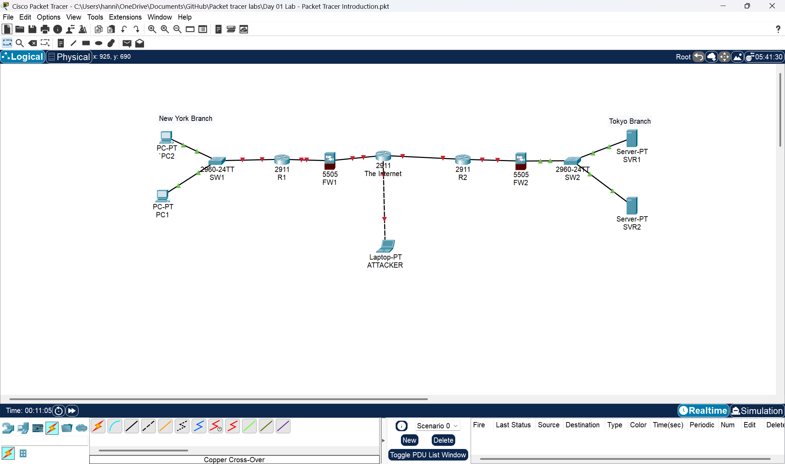
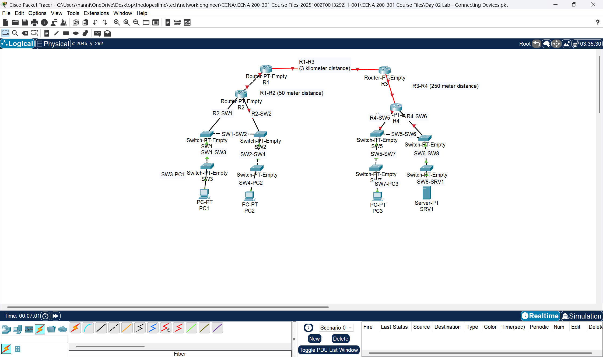
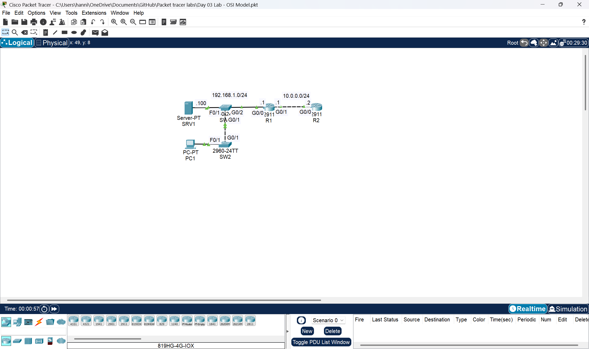

# Cisco-Packet-Tracer-Labs🌐
A collection of my Cisco Packet Tracer lab exercises which i made to practice and demonstrate networking concepts including routing, switching, VLAN configuration, subnetting, and network troubleshooting.

## 📅 Day 1 — Network Topology Setup (Packet Tracer Introduction)

### 🎯 Lab Objective

I created and connected a basic enterprise-style network topology using Cisco devices in **Cisco Packet Tracer**.

This lab focuses on:

* Understanding **network layout**
* Practicing **device selection**
* Building a **foundation for future configurations**

---

### 🧰 Devices Used

The following devices were used to build the topology:

* 🛣️ Cisco 2911 Routers (x2)
* 🔀 Cisco 2960 Switches (x2)
* 🔥 Cisco 5505 Firewalls (x2)
* 💻 PCs (x2)
* 🖥️ Servers (x2)
* 🧑‍💻 Laptop (Attacker machine)

---

### 🗺️ Network Topology

> 💡 This topology simulates a **secured network environment** with firewalls and an external attacker.

---

### 🔌 Connections

All devices were connected using:

> ⚡ **"Automatically Choose Connection Type"** in Cisco Packet Tracer

This ensured:

* Correct cable types are selected automatically
* Faster and easier setup for beginners

---

### 🧪 Lab Tasks

* [ ] Placef all required devices in the workspace
* [ ] Connect all devices correctly
* [ ] Ensure proper physical topology layout
* [ ] Label devices (optional but recommended)

---

### 📸 Screenshot

---
# 📅 Day 2 — Network Cabling & Device Connections

### 🎯 Lab Objective

Connected all devices in the topology using the **correct cable types** while assuming **Auto MDI-X is disabled**.

This lab focuses on:

* Proper **cable selection**
* Understanding **device-to-device connections**
* Building a correct **Layer 1 (Physical Layer)** network

---

### 🧰 Devices Used

* 🛣️ Routers (R1, R2, R3, R4)
* 🔀 Switches (SW1 – SW8)
* 💻 PCs (PC1, PC2, PC3)
* 🖥️ Server (SRV1)

---

### 🗺️ Topology Overview

* R1 connects to R2 and R3
* R3 connects to R4
* Each router connects to switches
* Switches connect to PCs and servers

Distances (important for media choice):

* R1 ↔ R2 → **50 meters**
* R3 ↔ R4 → **250 meters**
* R1 ↔ R3 → **3 kilometers**

---

### 🔌 Cable Selection Rules (Auto MDI-X Disabled)

| Connection         | Cable Type        |
| ------------------ | ----------------- |
| Router ↔ Router    | Crossover / Fiber |
| Router ↔ Switch    | Straight-through  |
| Switch ↔ Switch    | Crossover         |
| Switch ↔ PC/Server | Straight-through  |

---

### 🧠 Fiber Decision (Based on Distance)

| Link    | Distance | Recommended Cable   |
| ------- | -------- | ------------------- |
| R1 ↔ R2 | 50m      | Copper (Crossover)  |
| R3 ↔ R4 | 250m     | Fiber (Multimode)   |
| R1 ↔ R3 | 3km      | Fiber (Single-mode) |

> ⚠️ Packet Tracer does not differentiate between fiber types, but in real networks:

* **Multimode fiber** → short distance (LAN)
* **Single-mode fiber** → long distance (WAN)

---

### 🧪 Lab Tasks

* [ ] Connect all routers correctly
* [ ] Connect switches to routers
* [ ] Connect end devices (PCs, Server)
* [ ] Use correct cable types (no auto mode)
* [ ] Ensure all links are **green (active)**

---

### 📸 Topology Screenshot

---

## 📅 Day 3 — OSI Model & Traffic Analysis (Simulation Mode)

### 🎯 Lab Objective

Use **Simulation Mode in Cisco Packet Tracer** to analyze network traffic and understand how data moves through the **OSI Model layers**.

---

### 🧰 Devices Used

* 🛣️ Routers (R1, R2)
* 🔀 Switch (SW1, SW2)
* 💻 PC (PC1)
* 🖥️ Server (SRV1)

---

### 🌐 Network Overview

* LAN: **192.168.1.0/24**
* WAN: **10.0.0.0/24**
* PC1 and Server are in the same LAN
* Routers connect different networks

---

### 🔍 Task 1 — Analyze Traffic in Simulation Mode

#### Steps:

1. Switch to **Simulation Mode**
2. Generate traffic (e.g., ping from PC1 to Server)
3. Observe packets moving through the network
4. Click on packets to inspect details

---

### 🧠 OSI Layers Observed

During traffic analysis, the following OSI layers are used:

| Layer | Name        | Role in This Lab              |
| ----- | ----------- | ----------------------------- |
| 7     | Application | User interaction (ping, DHCP) |
| 4     | Transport   | TCP/UDP communication         |
| 3     | Network     | IP addressing & routing       |
| 2     | Data Link   | MAC addressing (switching)    |
| 1     | Physical    | Transmission of bits          |

---

### 📌 Key Observations

* **Layer 1 (Physical):** Signals travel through cables
* **Layer 2 (Data Link):** Switch uses MAC addresses
* **Layer 3 (Network):** Routers forward packets using IP
* **Layer 4 (Transport):** Handles communication reliability
* **Layer 7 (Application):** User-generated traffic

---

### 🔁 Task 2 — Generate Layer 7 Traffic (DHCP)

#### Steps:

1. Go to **PC1 → Desktop → IP Configuration**
2. Click:

   * **Release**
   * **Renew**
3. Switch to **Simulation Mode**
4. Observe the DHCP process

---

### 📡 DHCP Process Observed

When renewing IP, the following happens:

1. **DHCP Discover** (PC → Network)
2. **DHCP Offer** (Server → PC)
3. **DHCP Request** (PC → Server)
4. **DHCP Acknowledgment** (Server → PC)

---

### 🧠 OSI Layers in DHCP Traffic

* **Layer 7 (Application):** DHCP protocol
* **Layer 4 (Transport):** UDP (Ports 67 & 68)
* **Layer 3 (Network):** IP addressing
* **Layer 2 (Data Link):** Broadcast MAC address
* **Layer 1 (Physical):** Transmission

---

### 📸 Screenshot

---

