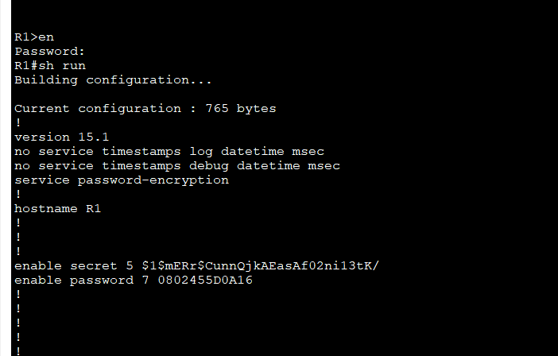
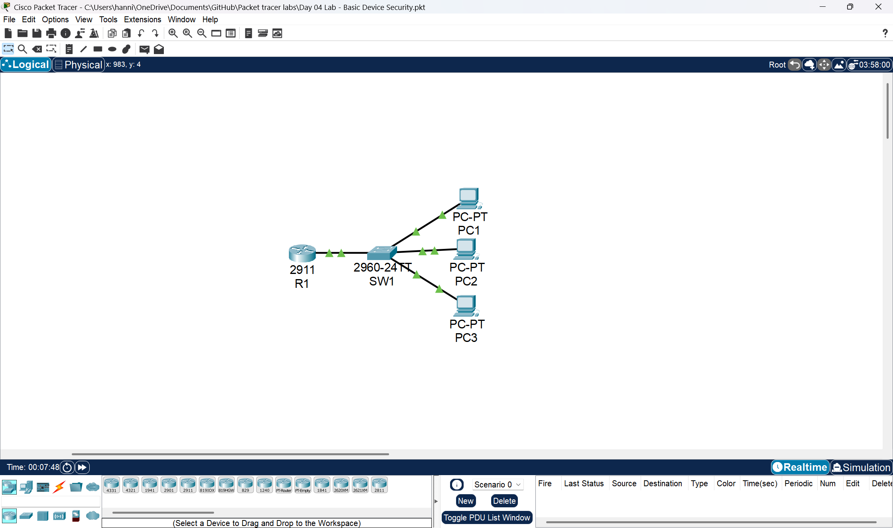
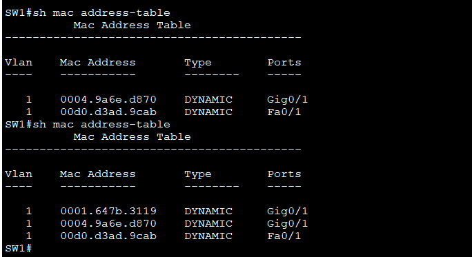
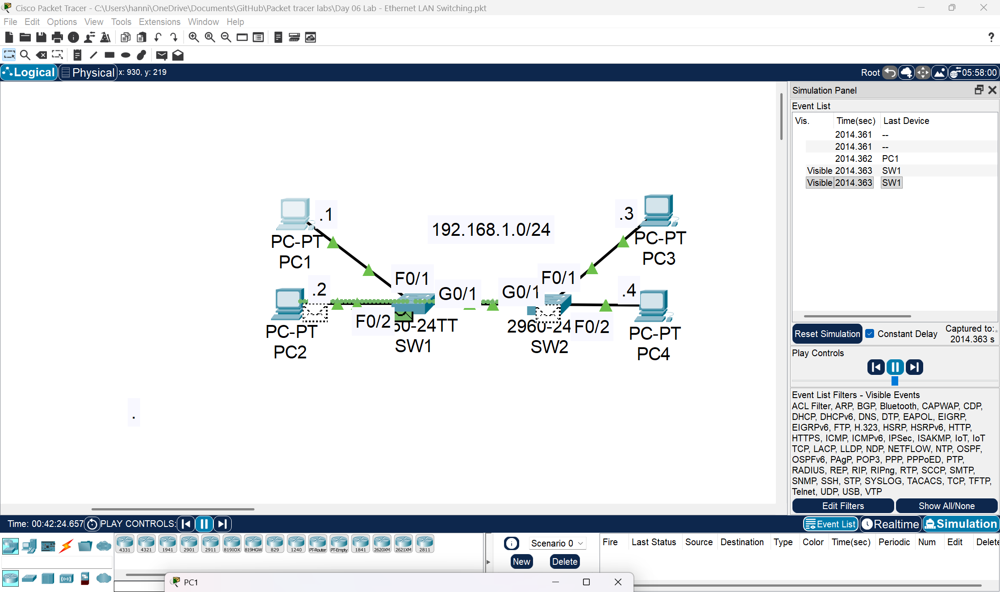

# Cisco-Packet-Tracer-Labs🌐
A collection of my Cisco Packet Tracer lab exercises which i made to practice and demonstrate networking concepts including routing, switching, VLAN configuration, subnetting, and network troubleshooting.


## 📅 Day 1 — Network Topology Setup (Packet Tracer Introduction)

### 🎯 Lab Objectives

I created and connected a basic enterprise-style network topology using Cisco devices in **Cisco Packet Tracer**.

This lab focuses on:

* Understanding **network layout**
* Practicing **device selection**
* Building a **foundation for future configurations**

---

### 🧰 Devices Used

The following devices were used to build the topology:

* 🛣️ Cisco 2911 Routers (x2)
* 🔀 Cisco 2960 Switches (x2)
* 🔥 Cisco 5505 Firewalls (x2)
* 💻 PCs (x2)
* 🖥️ Servers (x2)
* 🧑‍💻 Laptop (Attacker machine)

---

### 🗺️ Network Topology


> 💡 This topology simulates a **secured network environment** with firewalls and an external attacker.

---

### 🔌 Connections

All devices were connected using:

> ⚡ **"Automatically Choose Connection Type"** in Cisco Packet Tracer

This ensured:

* Correct cable types are selected automatically
* Faster and easier setup for beginners

---

### 🧪 Lab Tasks

* [ ] Placef all required devices in the workspace
* [ ] Connect all devices correctly
* [ ] Ensure proper physical topology layout
* [ ] Label devices (optional but recommended)

---

### 📸 Screenshot


---
# 📅 Day 2 — Network Cabling & Device Connections

### 🎯 Lab Objective

Connected all devices in the topology using the **correct cable types** while assuming **Auto MDI-X is disabled**.

This lab focuses on:

* Proper **cable selection**
* Understanding **device-to-device connections**
* Building a correct **Layer 1 (Physical Layer)** network

---

### 🧰 Devices Used

* 🛣️ Routers (R1, R2, R3, R4)
* 🔀 Switches (SW1 – SW8)
* 💻 PCs (PC1, PC2, PC3)
* 🖥️ Server (SRV1)

---

### 🗺️ Topology Overview

* R1 connects to R2 and R3
* R3 connects to R4
* Each router connects to switches
* Switches connect to PCs and servers

Distances (important for media choice):

* R1 ↔ R2 → **50 meters**
* R3 ↔ R4 → **250 meters**
* R1 ↔ R3 → **3 kilometers**

---

### 🔌 Cable Selection Rules (Auto MDI-X Disabled)

| Connection         | Cable Type        |
| ------------------ | ----------------- |
| Router ↔ Router    | Crossover / Fiber |
| Router ↔ Switch    | Straight-through  |
| Switch ↔ Switch    | Crossover         |
| Switch ↔ PC/Server | Straight-through  |

---

### 🧠 Fiber Decision (Based on Distance)

| Link    | Distance | Recommended Cable   |
| ------- | -------- | ------------------- |
| R1 ↔ R2 | 50m      | Copper (Crossover)  |
| R3 ↔ R4 | 250m     | Fiber (Multimode fiber)   |
| R1 ↔ R3 | 3km      | Fiber (Single-mode fiber) |

> ⚠️ Packet Tracer does not differentiate between fiber types, but in real networks:

* **Multimode fiber** → short distance (LAN)
* **Single-mode fiber** → long distance (WAN)

---

### 🧪 Lab Tasks

* [ ] Connect all routers correctly
* [ ] Connect switches to routers
* [ ] Connect end devices (PCs, Server)
* [ ] Use correct cable types (no auto mode)
* [ ] Ensure all links are **green (active)**

---

### 📸 Topology Screenshot


---


## 📅 Day 3 — OSI Model & Traffic Analysis (Simulation Mode)

### 🎯 Lab Objective

Use **Simulation Mode in Cisco Packet Tracer** to analyze network traffic and understand how data moves through the **OSI Model layers**.

---

### 🧰 Devices Used

* 🛣️ Routers (R1, R2)
* 🔀 Switch (SW1, SW2)
* 💻 PC (PC1)
* 🖥️ Server (SRV1)

---

### 🌐 Network Overview

* LAN: **192.168.1.0/24**
* WAN: **10.0.0.0/24**
* PC1 and Server are in the same LAN
* Routers connect different networks

---

### 🔍 Task 1 — Analyze Traffic in Simulation Mode

#### Steps:

1. Switch to **Simulation Mode**
2. Generate traffic (e.g., ping from PC1 to Server)
3. Observe packets moving through the network
4. Click on packets to inspect details

---

### 🧠 OSI Layers Observed

During traffic analysis, the following OSI layers are used:

| Layer | Name        | Role in This Lab              |
| ----- | ----------- | ----------------------------- |
| 7     | Application | User interaction (ping, DHCP) |
| 4     | Transport   | TCP/UDP communication         |
| 3     | Network     | IP addressing & routing       |
| 2     | Data Link   | MAC addressing (switching)    |
| 1     | Physical    | Transmission of bits          |

---

### 📌 Key Observations

* **Layer 1 (Physical):** Signals travel through cables
* **Layer 2 (Data Link):** Switch uses MAC addresses
* **Layer 3 (Network):** Routers forward packets using IP
* **Layer 4 (Transport):** Handles communication reliability
* **Layer 7 (Application):** User-generated traffic

---

### 🔁 Task 2 — Generate Layer 7 Traffic (DHCP)

#### Steps:

1. Go to **PC1 → Desktop → IP Configuration**
2. Click:

   * **Release**
   * **Renew**
3. Switch to **Simulation Mode**
4. Observe the DHCP process

---

### 📡 DHCP Process Observed

When renewing IP, the following happens:

1. **DHCP Discover** (PC → Network)
2. **DHCP Offer** (Server → PC)
3. **DHCP Request** (PC → Server)
4. **DHCP Acknowledgment** (Server → PC)

---

### 🧠 OSI Layers in DHCP Traffic

* **Layer 7 (Application):** DHCP protocol
* **Layer 4 (Transport):** UDP (Ports 67 & 68)
* **Layer 3 (Network):** IP addressing
* **Layer 2 (Data Link):** Broadcast MAC address
* **Layer 1 (Physical):** Transmission

---

### 📸 Network Topology Screenshot


---


## 📅 Day 4 — Basic Device Security (CLI Configuration)

### 🎯 Lab Objective

Configure basic security settings on Cisco devices using the CLI, including:

* Hostnames
* Enable passwords
* Password encryption
* Secure access configurations

---

### 🧰 Devices Used

* 🛣️ Router (R1)
* 🔀 Switch (SW1)
* 💻 PCs (PC1, PC2, PC3)

---

### 🔐 Step 1 — Configure Hostnames

Enter global configuration mode and set device names:

```
enable
configure terminal
hostname R1
```

(On switch)

```
enable
configure terminal
hostname SW1
```

---

### 🔑 Step 2 — Configure Enable Password (Unencrypted)

```
enable
configure terminal
enable password CCNA
```

---

### 🧪 Step 3 — Test the Password

```
exit
enable
```

Enter password:

```
CCNA
```

---

### 🔍 Step 4 — View Running Configuration

```
show running-config
```

> ⚠️ You will see the password in **plain text**

---

### 🔒 Step 5 — Encrypt All Passwords

```
configure terminal
service password-encryption
```

---

### 🔍 Step 6 — Verify Encryption

```
show running-config
```

> ✅ Password is now encrypted (Type 7)

---

### 🔐 Step 7 — Configure Secure Enable Secret

```
configure terminal
enable secret Cisco
```

---

### 🧪 Step 8 — Test Access

```
exit
enable
```

👉 You must use:

```
Cisco
```

> ✅ `enable secret` overrides `enable password`

---

### 🔍 Step 9 — Check Encryption Types

```
show running-config
```

### Observations:

* `enable password` → **Type 7** (weak encryption)
* `enable secret` → **Type 5** (strong MD5 hash)

  

---

### 💾 Step 10 — Save Configuration

```
copy running-config startup-config
```

OR

```
write memory
```

---

### 📸 Topology Screenshot





---


## Day 5 ⏸️ Lab Progress — Break After Day 4

### 📌 Overview

Progress on this Cisco Packet Tracer lab series is currently **paused after Day 4**.

This break was taken to:

* 🧠 Reinforce core networking concepts
* 📖 Review key topics before moving forward
* 🧹 Organize lab files and documentation
* ⚡ Maintain consistent and effective learning

---

### 📅 Current Progress

* ✅ Day 1 — Network Topology Setup
* ✅ Day 2 — Device Connections & Cabling
* ✅ Day 3 — OSI Model & Traffic Analysis
* ✅ Day 4 — Basic Device Security
* ⏸️ **Paused Here**

---

### 🧠 Topics Covered So Far

* Network topology design
* Cable types and connections
* OSI Model (Layer 1–7)
* Simulation mode (traffic analysis)
* Basic device security:

  * Hostnames
  * Enable password vs enable secret
  * Password encryption

---

### 🚀 Plan After Break

* 🔀 MAC Address Learning
* 📡 ARP (Address Resolution Protocol)
* 🔁 Switching behavior
* 🧠 Network communication fundamentals


---

## 📅 Day 6 — MAC Address Learning & ARP (Multi-Switch Network)

### 🎯 Lab Objective

Analyze how **ARP (Address Resolution Protocol)** and **MAC address learning** work in a network with **multiple switches**.

---

### 🧰 Devices Used

* 🔀 Switches:

  * SW1 (2960-24TT)
  * SW2 (2960-24TT)
* 💻 PCs:

  * PC1 → 192.168.1.1
  * PC2 → 192.168.1.2
  * PC3 → 192.168.1.3
  * PC4 → 192.168.1.4

---

### 🌐 Network Overview

* Network: **192.168.1.0/24**
* SW1 connected to SW2
* All PCs are in the **same broadcast domain**

---

### 🧠 Initial State

* MAC address tables → ❌ Empty (both switches)
* ARP tables → ❌ Empty (all PCs)

---

### 🔍 Task 1 — PC1 Pings PC3

#### 🧩 What Happens?

### 1️⃣ ARP Request (Broadcast)

PC1 sends:

```
Who has 192.168.1.3?
```

* Destination MAC: `FF:FF:FF:FF:FF:FF`

### 📡 Path:

* PC1 → SW1

* SW1 floods to:

  * PC2
  * SW2

* SW2 floods to:

  * PC3
  * PC4

✅ Devices that receive ARP request:

* PC2
* PC3
* PC4

---

### 2️⃣ ARP Reply (Unicast)

PC3 responds:

```id="arp_rep6"
192.168.1.3 is at <PC3-MAC>
```

### 📡 Path:

* PC3 → SW2
* SW2 → SW1
* SW1 → PC1

✅ Only PC1 receives the reply

---

### 3️⃣ ICMP Communication

* PC1 sends ICMP Echo Request → PC3
* PC3 replies with Echo Reply

---

### 📊 Traffic Summary

| Message      | Type      | Behavior                     |
| ------------ | --------- | ---------------------------- |
| ARP Request  | Broadcast | Flooded across both switches |
| ARP Reply    | Unicast   | Sent directly to PC1         |
| ICMP Request | Unicast   | PC1 → PC3                    |
| ICMP Reply   | Unicast   | PC3 → PC1                    |

---

### 🧪 Task 2 — Simulation Mode Verification

Steps:

1. Switch to **Simulation Mode**
2. Ping from PC1 → PC3
3. Observe:

   * Broadcast flooding
   * ARP reply path
   * ICMP packets

---

### 🔁 Task 3 — MAC Address Learning

Generate traffic:

* PC1 ↔ PC2
* PC1 ↔ PC3
* PC1 ↔ PC4

### 🧠 Result:

Switches learn MAC addresses from **source MAC**:

* SW1 learns:

  * PC1, PC2
* SW2 learns:

  * PC3, PC4

---

### 🔍 Task 4 — View MAC Address Table

```
show mac address-table
```



### Expected:

* SW1 → PC1, PC2 + link to SW2
* SW2 → PC3, PC4 + link to SW1

---

### 🧹 Task 5 — Clear MAC Address Table

```
clear mac address-table dynamic
```

---

### 🔍 Verify

```
show mac address-table
```

> Table should be empty

---


### 📸 Topology Screenshot




---


