# Cisco-Packet-Tracer-Labs🌐
A collection of my Cisco Packet Tracer lab exercises which i made to practice and demonstrate networking concepts including routing, switching, VLAN configuration, subnetting, and network troubleshooting.


## 📅 Day 1 — Network Topology Setup (Introducton)

### 🎯 Lab Objectives

I created and connected a basic enterprise-style network topology using Cisco devices in **Cisco Packet Tracer**.

This lab focuses on:

* Understanding **network layout**
* Practicing **device selection**
* Building a **foundation for future configurations**

---

### 🧰 Devices Used

The following devices were used to build the topology:

* 🛣️ Cisco 2911 Routers (x2)
* 🔀 Cisco 2960 Switches (x2)
* 🔥 Cisco 5505 Firewalls (x2)
* 💻 PCs (x2)
* 🖥️ Servers (x2)
* 🧑‍💻 Laptop (Attacker machine)

---

### 🗺️ Network Topology


> 💡 This topology simulates a **secured network environment** with firewalls and an external attacker.

---

### 🔌 Connections

All devices were connected using:

> ⚡ **"Automatically Choose Connection Type"** in Cisco Packet Tracer

This ensured:

* Correct cable types are selected automatically
* Faster and easier setup for beginners

---

### 🧪 Lab Tasks

* [ ] Placef all required devices in the workspace
* [ ] Connect all devices correctly
* [ ] Ensure proper physical topology layout
* [ ] Label devices (optional but recommended)

---

### 📸 Screenshot


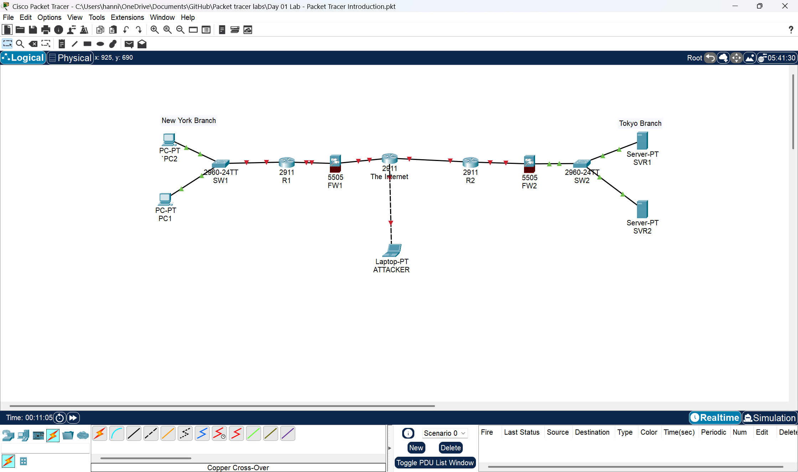


---
# 📅 Day 2 — Network Cabling & Device Connections

### 🎯 Lab Objective

Connected all devices in the topology using the **correct cable types** while assuming **Auto MDI-X is disabled**.

This lab focuses on:

* Proper **cable selection**
* Understanding **device-to-device connections**
* Building a correct **Layer 1 (Physical Layer)** network

---

### 🧰 Devices Used

* 🛣️ Routers (R1, R2, R3, R4)
* 🔀 Switches (SW1 – SW8)
* 💻 PCs (PC1, PC2, PC3)
* 🖥️ Server (SRV1)

---

### 🗺️ Topology Overview

* R1 connects to R2 and R3
* R3 connects to R4
* Each router connects to switches
* Switches connect to PCs and servers

Distances (important for media choice):

* R1 ↔ R2 → **50 meters**
* R3 ↔ R4 → **250 meters**
* R1 ↔ R3 → **3 kilometers**

---

### 🔌 Cable Selection Rules (Auto MDI-X Disabled)

| Connection         | Cable Type        |
| ------------------ | ----------------- |
| Router ↔ Router    | Crossover / Fiber |
| Router ↔ Switch    | Straight-through  |
| Switch ↔ Switch    | Crossover         |
| Switch ↔ PC/Server | Straight-through  |

---

### 🧠 Fiber Decision (Based on Distance)

| Link    | Distance | Recommended Cable   |
| ------- | -------- | ------------------- |
| R1 ↔ R2 | 50m      | Copper (Crossover)  |
| R3 ↔ R4 | 250m     | Fiber (Multimode fiber)   |
| R1 ↔ R3 | 3km      | Fiber (Single-mode fiber) |

> ⚠️ Packet Tracer does not differentiate between fiber types, but in real networks:

* **Multimode fiber** → short distance (LAN)
* **Single-mode fiber** → long distance (WAN)

---

### 🧪 Lab Tasks

* [ ] Connect all routers correctly
* [ ] Connect switches to routers
* [ ] Connect end devices (PCs, Server)
* [ ] Use correct cable types (no auto mode)
* [ ] Ensure all links are **green (active)**

---

### 📸 Topology Screenshot

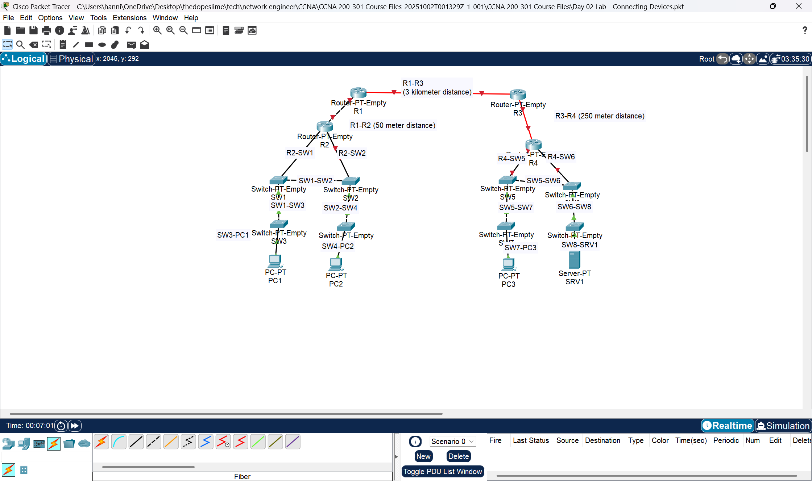


---


## 📅 Day 3 — OSI Model & Traffic Analysis (Simulation Mode)

### 🎯 Lab Objective

Use **Simulation Mode in Cisco Packet Tracer** to analyze network traffic and understand how data moves through the **OSI Model layers**.

---

### 🧰 Devices Used

* 🛣️ Routers (R1, R2)
* 🔀 Switch (SW1, SW2)
* 💻 PC (PC1)
* 🖥️ Server (SRV1)

---

### 🌐 Network Overview

* LAN: **192.168.1.0/24**
* WAN: **10.0.0.0/24**
* PC1 and Server are in the same LAN
* Routers connect different networks

---

### 🔍 Task 1 — Analyze Traffic in Simulation Mode

#### Steps:

1. Switch to **Simulation Mode**
2. Generate traffic (e.g., ping from PC1 to Server)
3. Observe packets moving through the network
4. Click on packets to inspect details

---

### 🧠 OSI Layers Observed

During traffic analysis, the following OSI layers are used:

| Layer | Name        | Role in This Lab              |
| ----- | ----------- | ----------------------------- |
| 7     | Application | User interaction (ping, DHCP) |
| 4     | Transport   | TCP/UDP communication         |
| 3     | Network     | IP addressing & routing       |
| 2     | Data Link   | MAC addressing (switching)    |
| 1     | Physical    | Transmission of bits          |

---

### 📌 Key Observations

* **Layer 1 (Physical):** Signals travel through cables
* **Layer 2 (Data Link):** Switch uses MAC addresses
* **Layer 3 (Network):** Routers forward packets using IP
* **Layer 4 (Transport):** Handles communication reliability
* **Layer 7 (Application):** User-generated traffic

---

### 🔁 Task 2 — Generate Layer 7 Traffic (DHCP)

#### Steps:

1. Go to **PC1 → Desktop → IP Configuration**
2. Click:

   * **Release**
   * **Renew**
3. Switch to **Simulation Mode**
4. Observe the DHCP process

---

### 📡 DHCP Process Observed

When renewing IP, the following happens:

1. **DHCP Discover** (PC → Network)
2. **DHCP Offer** (Server → PC)
3. **DHCP Request** (PC → Server)
4. **DHCP Acknowledgment** (Server → PC)

---

### 🧠 OSI Layers in DHCP Traffic

* **Layer 7 (Application):** DHCP protocol
* **Layer 4 (Transport):** UDP (Ports 67 & 68)
* **Layer 3 (Network):** IP addressing
* **Layer 2 (Data Link):** Broadcast MAC address
* **Layer 1 (Physical):** Transmission

---

### 📸 Network Topology Screenshot


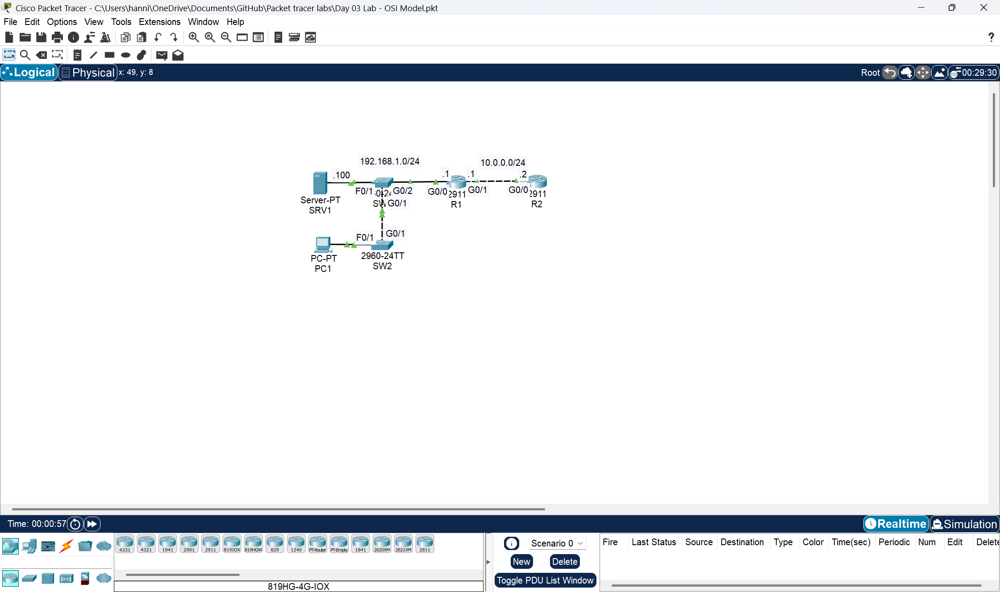

---


## 📅 Day 4 — Basic Device Security (CLI Configuration)

### 🎯 Lab Objective

Configure basic security settings on Cisco devices using the CLI, including:

* Hostnames
* Enable passwords
* Password encryption
* Secure access configurations

---

### 🧰 Devices Used

* 🛣️ Router (R1)
* 🔀 Switch (SW1)
* 💻 PCs (PC1, PC2, PC3)

---

### 🔐 Step 1 — Configure Hostnames

Enter global configuration mode and set device names:

```
enable
configure terminal
hostname R1
```

(On switch)

```
enable
configure terminal
hostname SW1
```

---

### 🔑 Step 2 — Configure Enable Password (Unencrypted)

```
enable
configure terminal
enable password CCNA
```

---

### 🧪 Step 3 — Test the Password

```
exit
enable
```

Enter password:

```
CCNA
```

---

### 🔍 Step 4 — View Running Configuration

```
show running-config
```

> ⚠️ You will see the password in **plain text**

---

### 🔒 Step 5 — Encrypt All Passwords

```
configure terminal
service password-encryption
```

---

### 🔍 Step 6 — Verify Encryption

```
show running-config
```

> ✅ Password is now encrypted (Type 7)

---

### 🔐 Step 7 — Configure Secure Enable Secret

```
configure terminal
enable secret Cisco
```

---

### 🧪 Step 8 — Test Access

```
exit
enable
```

👉 You must use:

```
Cisco
```

> ✅ `enable secret` overrides `enable password`

---

### 🔍 Step 9 — Check Encryption Types

```
show running-config
```

### Observations:

* `enable password` → **Type 7** (weak encryption)
* `enable secret` → **Type 5** (strong MD5 hash)

  
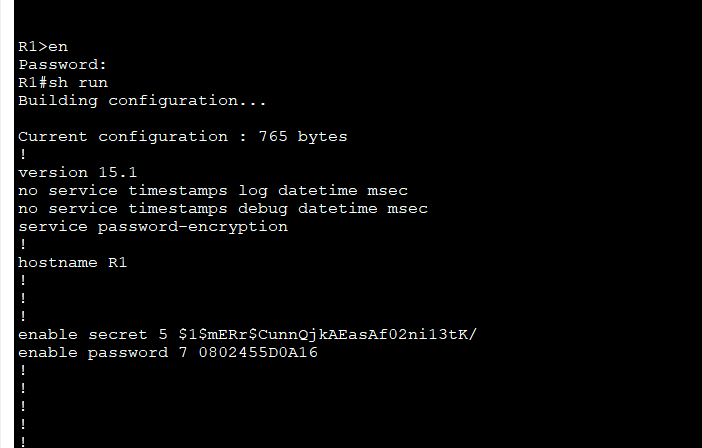
---

### 💾 Step 10 — Save Configuration

```
copy running-config startup-config
```

OR

```
write memory
```

---

### 📸 Topology Screenshot


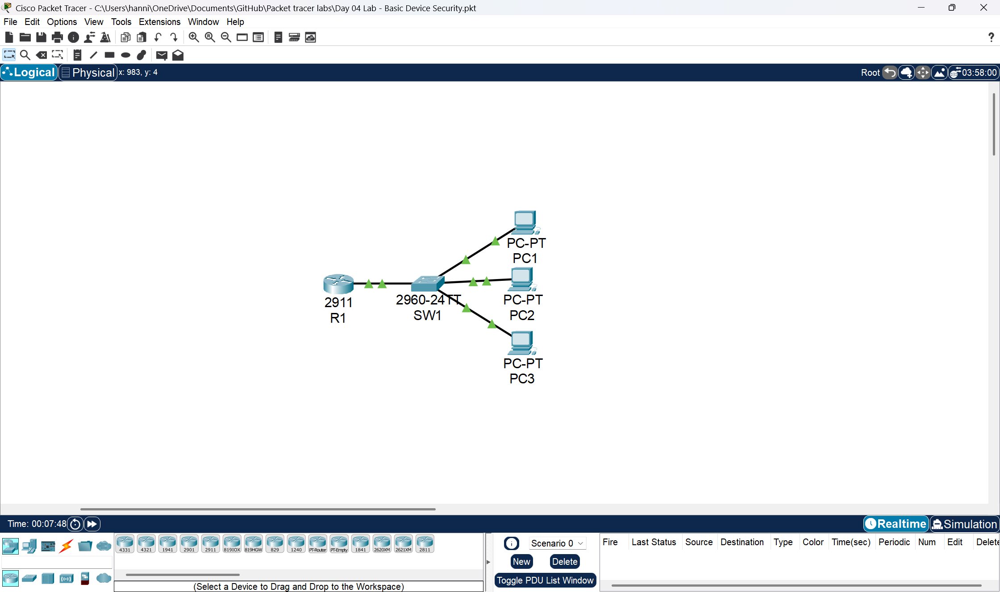


---


## Day 5 ⏸️ Lab Progress — Break After Day 4

### 📌 Overview

Progress on this Cisco Packet Tracer lab series is currently **paused after Day 4**.

This break was taken to:

* 🧠 Reinforce core networking concepts
* 📖 Review key topics before moving forward
* 🧹 Organize lab files and documentation
* ⚡ Maintain consistent and effective learning

---

### 📅 Current Progress

* ✅ Day 1 — Network Topology Setup
* ✅ Day 2 — Device Connections & Cabling
* ✅ Day 3 — OSI Model & Traffic Analysis
* ✅ Day 4 — Basic Device Security
* ⏸️ **Paused Here**

---

### 🧠 Topics Covered So Far

* Network topology design
* Cable types and connections
* OSI Model (Layer 1–7)
* Simulation mode (traffic analysis)
* Basic device security:

  * Hostnames
  * Enable password vs enable secret
  * Password encryption

---

### 🚀 Plan After Break

* 🔀 MAC Address Learning
* 📡 ARP (Address Resolution Protocol)
* 🔁 Switching behavior
* 🧠 Network communication fundamentals


---

## 📅 Day 6 — MAC Address Learning & ARP (Multi-Switch Network)

### 🎯 Lab Objective

Analyze how **ARP (Address Resolution Protocol)** and **MAC address learning** work in a network with **multiple switches**.

---

### 🧰 Devices Used

* 🔀 Switches:

  * SW1 (2960-24TT)
  * SW2 (2960-24TT)
* 💻 PCs:

  * PC1 → 192.168.1.1
  * PC2 → 192.168.1.2
  * PC3 → 192.168.1.3
  * PC4 → 192.168.1.4

---

### 🌐 Network Overview

* Network: **192.168.1.0/24**
* SW1 connected to SW2
* All PCs are in the **same broadcast domain**

---

### 🧠 Initial State

* MAC address tables → ❌ Empty (both switches)
* ARP tables → ❌ Empty (all PCs)

---

### 🔍 Task 1 — PC1 Pings PC3

#### 🧩 What Happens?

### 1️⃣ ARP Request (Broadcast)

PC1 sends:

```
Who has 192.168.1.3?
```

* Destination MAC: `FF:FF:FF:FF:FF:FF`

### 📡 Path:

* PC1 → SW1

* SW1 floods to:

  * PC2
  * SW2

* SW2 floods to:

  * PC3
  * PC4

✅ Devices that receive ARP request:

* PC2
* PC3
* PC4

---

### 2️⃣ ARP Reply (Unicast)

PC3 responds:

```id="arp_rep6"
192.168.1.3 is at <PC3-MAC>
```

### 📡 Path:

* PC3 → SW2
* SW2 → SW1
* SW1 → PC1

✅ Only PC1 receives the reply

---

### 3️⃣ ICMP Communication

* PC1 sends ICMP Echo Request → PC3
* PC3 replies with Echo Reply

---

### 📊 Traffic Summary

| Message      | Type      | Behavior                     |
| ------------ | --------- | ---------------------------- |
| ARP Request  | Broadcast | Flooded across both switches |
| ARP Reply    | Unicast   | Sent directly to PC1         |
| ICMP Request | Unicast   | PC1 → PC3                    |
| ICMP Reply   | Unicast   | PC3 → PC1                    |

---

### 🧪 Task 2 — Simulation Mode Verification

Steps:

1. Switch to **Simulation Mode**
2. Ping from PC1 → PC3
3. Observe:

   * Broadcast flooding
   * ARP reply path
   * ICMP packets

---

### 🔁 Task 3 — MAC Address Learning

Generate traffic:

* PC1 ↔ PC2
* PC1 ↔ PC3
* PC1 ↔ PC4

### 🧠 Result:

Switches learn MAC addresses from **source MAC**:

* SW1 learns:

  * PC1, PC2
* SW2 learns:

  * PC3, PC4

---

### 🔍 Task 4 — View MAC Address Table

```
show mac address-table
```

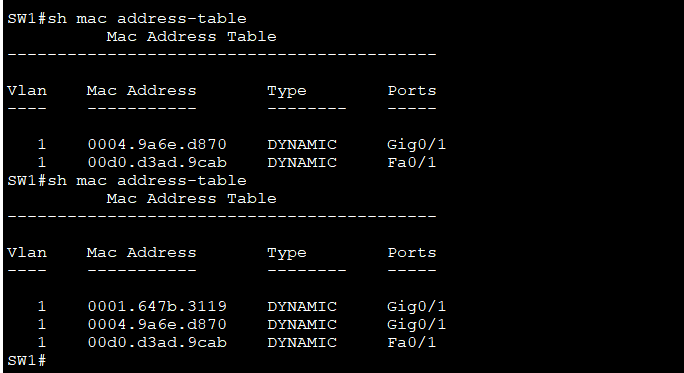

#### Expected:

* SW1 → PC1, PC2 + link to SW2
* SW2 → PC3, PC4 + link to SW1

---

### 🧹 Task 5 — Clear MAC Address Table

```
clear mac address-table dynamic
```

---

### 🔍 Verify

```
show mac address-table
```

> Table should be empty

---


### 📸 Topology Screenshot

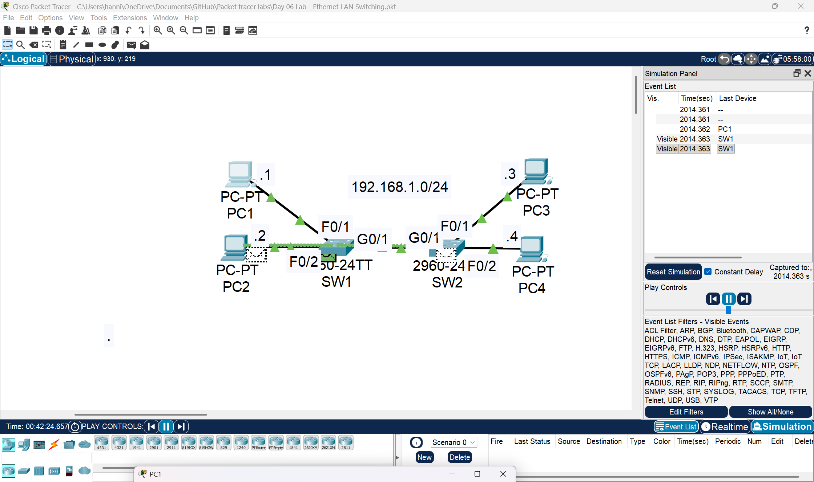


---

## 📅 Day 7 — Basic Router Configuration & Connectivity

### 🎯 Lab Objective

Learn how to:

* Configure a router’s hostname
* Assign IP addresses to router interfaces
* Enable interfaces
* Configure PCs with IP addresses
* Test connectivity using ping

---

### 🧰 Devices Used

* 🛣️ Router:

  * R1 (2911)
* 🔀 Switches:

  * SW1, SW2, SW3 (2960-24TT)
* 💻 PCs:

  * PC1 → 15.0.0.1
  * PC2 → 182.98.0.1
  * PC3 → 201.191.20.1

---

### 🌐 Network Overview

| Network         | Interface | IP Address     |
| --------------- | --------- | -------------- |
| 15.0.0.0/8      | G0/0      | 15.255.255.254 |
| 182.98.0.0      | G0/1      | 182.98.255.254 |
| 201.191.20.0/24 | G0/2      | 201.191.20.254 |

---

### 🔧 Task 1 — Configure Hostname

```
enable
configure terminal
hostname R1
```

---

### 🔍 Task 2 — View Interfaces

```
show ip interface brief
```

This displays:

* Interface names
* IP addresses
* Status (up/down)

---

## ⚙️ Task 3 — Configure Interfaces

#### G0/0 (Network 15.0.0.0/8)

```
interface g0/0
ip address 15.255.255.254 255.0.0.0
description Connection to SW1 (PC1 Network)
no shutdown
exit
```

---

#### G0/1 (Network 182.98.0.0)

```
interface g0/1
ip address 182.98.255.254 255.255.0.0
description Connection to SW2 (PC2 Network)
no shutdown
exit
```

---

#### G0/2 (Network 201.191.20.0/24)

```
interface g0/2
ip address 201.191.20.254 255.255.255.0
description Connection to SW3 (PC3 Network)
no shutdown
exit
```

---

### 🔍 Task 4 — Verify Interfaces

```
show ip interface brief
```

✅ All interfaces should show:

* Status: **up**
* Protocol: **up**

---

### 📄 Task 5 — View & Save Configuration

#### View running config:

```
show running-config
```

### Save configuration:

```
copy running-config startup-config
```

---

#### 💻 Task 6 — Configure PC IP Addresses

#### PC1:

* IP: 15.0.0.1
* Subnet Mask: 255.0.0.0
* Default Gateway: 15.255.255.254

---

#### PC2:

* IP: 182.98.0.1
* Subnet Mask: 255.255.0.0
* Default Gateway: 182.98.255.254

---

#### PC3:

* IP: 201.191.20.1
* Subnet Mask: 255.255.255.0
* Default Gateway: 201.191.20.254

---

## 🧪 Task 7 — Test Connectivity

### From PC1:

```
ping 182.98.0.1
ping 201.191.20.1
```

---

## 📊 Expected Results

* PC1 → PC2 ✅ Success
* PC1 → PC3 ✅ Success


---

## 📸 Topology Screenshot


---

## 📅 Day 8 — Interface Configuration & Switch Hardening

### 🎯 Lab Objectives

In this lab you will:

- Configure the hostname of **R1**, **SW1**, and **SW2**
- Configure the appropriate IP addresses on **R1**, **PC1**, **PC2**, **PC3**, and **PC4**
- Manually configure **speed** and **duplex** on interfaces connected to other networking devices
- Configure clear **descriptions** on each interface
- Disable switch interfaces that are not connected to other devices

---

### 🧰 Devices Used

- 🛣️ Router:
  - **R1** (2911)
- 🔀 Switches:
  - **SW1**, **SW2** (2960-24TT)
- 💻 PCs:
  - **PC1**
  - **PC2**
  - **PC3**
  - **PC4**

---

### 🌐 Network Overview

| Device | Interface | IP Address | Subnet Mask | Notes |
| ------- | --------- | ---------- | ----------- | ----- |
| R1 | G0/0 | 172.16.255.254 | 255.255.0.0 | Gateway for PCs |
| PC1 | F0/1 → SW1 | 172.16.0.1 | 255.255.0.0 | |
| PC2 | F0/2 → SW1 | 172.16.0.2 | 255.255.0.0 | |
| PC3 | F0/1 → SW2 | 172.16.0.3 | 255.255.0.0 | |
| PC4 | F0/2 → SW2 | 172.16.0.4 | 255.255.0.0 | |

**Default Gateway:** `172.16.255.254`

---

### 🔧 Task 1 — Configure Hostnames

#### R1

```plaintext
enable
configure terminal
hostname R1
```

#### SW1

```plaintext
enable
configure terminal
hostname SW1
```

#### SW2

```plaintext
enable
configure terminal
hostname SW2
```

---

### ⚙️ Task 2 — Configure Router Interface

#### G0/0 (Connected to SW1)

```plaintext
interface g0/0
ip address 172.16.255.254 255.255.0.0
no shutdown
duplex full
speed 100
description ## TO SW1 ##
```

---

### ⚙️ Task 3 — Configure Switch Uplinks (Speed/Duplex/Descriptions)

#### SW1

**Configure uplink to R1**

```plaintext
interface g0/1
duplex full
speed 100
description ## TO R1 ##
```

**Configure uplink to SW2**

```plaintext
interface g0/2
duplex full
speed 100
description ## TO SW2 ##
```

**Mark access ports to PCs**

```plaintext
interface range f0/1-2
description ## TO ENDHOSTS ##
```

**Shutdown unused ports**

```plaintext
interface range f0/3-24
description ## DO NOT TOUCH ##
shutdown
```

**Verify**

```plaintext
show interfaces status
```

---

#### SW2

**Configure uplink to SW1**

```plaintext
interface g0/1
duplex full
speed 100
description ## TO SW1 ##
```

**Configure access ports**

```plaintext
interface range f0/1-2
description ## TO ENDHOSTS ##
no shutdown
```

**Shutdown unused ports**

```plaintext
interface range f0/3-24
description ## DO NOT TOUCH ##
shutdown
```

**Verify**

```plaintext
show interfaces status
```

---
### Router Configuration 

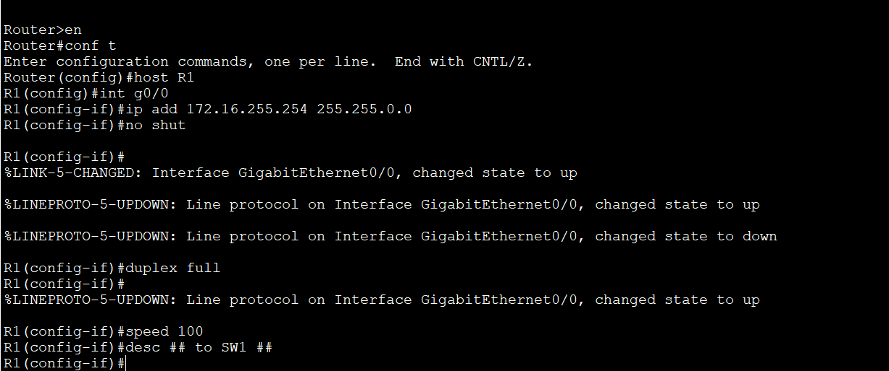 


---
### Switch Configuration 
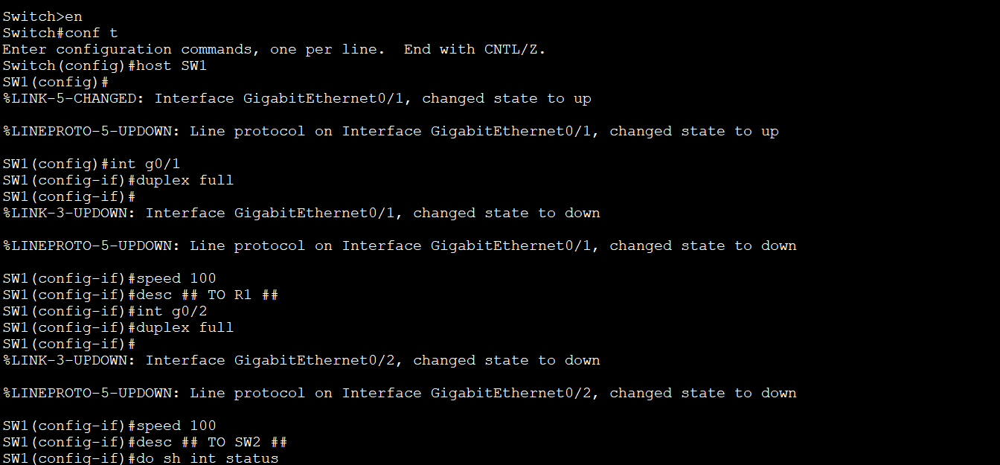 


---


### 💻 Task 4 — Configure PC IP Settings

All PCs use:

- **Subnet Mask:** `255.255.0.0`
- **Default Gateway:** `172.16.255.254`

#### PC1

- IP Address: **172.16.0.1**
- Subnet Mask: **255.255.0.0**
- Default Gateway: **172.16.255.254**

---

#### PC2

- IP Address: **172.16.0.2**
- Subnet Mask: **255.255.0.0**
- Default Gateway: **172.16.255.254**

---

#### PC3

- IP Address: **172.16.0.3**
- Subnet Mask: **255.255.0.0**
- Default Gateway: **172.16.255.254**

---

#### PC4

- IP Address: **172.16.0.4**
- Subnet Mask: **255.255.0.0**
- Default Gateway: **172.16.255.254**

---

### 🔍 Task 5 — Verify & Save Configuration

#### On R1

```plaintext
show ip interface brief
show running-config
copy running-config startup-config
```

#### On SW1

```plaintext
show interfaces status
show running-config
copy running-config startup-config
```

#### On SW2

```plaintext
show interfaces status
show running-config
copy running-config startup-config
```

All active interfaces connecting devices should show:

- Status: **up**
- Protocol: **up**

Unused ports should be **administratively down**.

---

## 🧪 Task 6 — Test Connectivity

### From PC1

```plaintext
ping 172.16.255.254
ping 172.16.0.2
ping 172.16.0.3
ping 172.16.0.4
```

---

## 📊 Expected Results

- PC1 → Default Gateway ✅ Success
- PC1 → PC2 ✅ Success
- PC1 → PC3 ✅ Success
- PC1 → PC4 ✅ Success
- All uplink links remain **up/up**
- All unused switch ports are **administratively down**

---

## 📸 Topology Screenshot

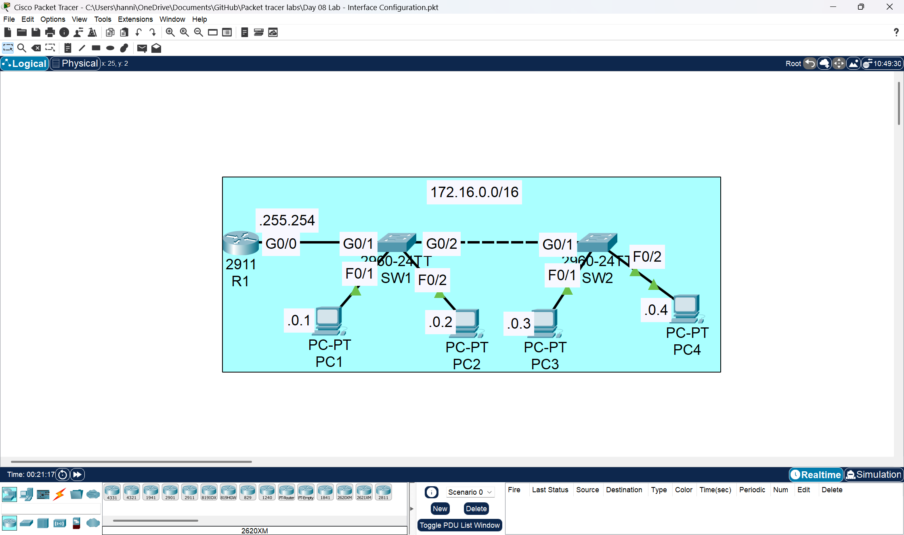

---

## 📅 Day 9 — Configuring Static Routes

### 🎯 Lab Objective

Learn how to:

- Configure hostnames on multiple routers
- Assign IP addresses to router interfaces
- Configure PC IP addresses and default gateways
- Configure static routes between routers
- Verify routing tables
- Test end-to-end connectivity using ping

---

### 🧰 Devices Used

- 🛣️ Routers:
  - R1 (2911)
  - R2 (2911)
  - R3 (2911)

- 🔀 Switches:
  - SW1 (2960-24TT)
  - SW2 (2960-24TT)

- 💻 PCs:
  - PC1 → 192.168.1.1
  - PC2 → 192.168.3.1

---

### 🌐 Network Overview

| Network | Router Interface | IP Address |
| -------- | ---------------- | ---------- |
| 192.168.1.0/24 | R1 G0/1 | 192.168.1.254 |
| 192.168.12.0/24 | R1 G0/0 | 192.168.12.1 |
| 192.168.12.0/24 | R2 G0/0 | 192.168.12.2 |
| 192.168.13.0/24 | R2 G0/1 | 192.168.13.2 |
| 192.168.13.0/24 | R3 G0/0 | 192.168.13.3 |
| 192.168.3.0/24 | R3 G0/1 | 192.168.3.254 |

---

### 🔧 Task 1 — Configure R1

#### Configure Hostname

```plaintext
enable
configure terminal
hostname R1
```

#### Configure G0/1 (LAN)

```plaintext
interface g0/1
ip address 192.168.1.254 255.255.255.0
no shutdown
exit
```

#### Configure G0/0 (Link to R2)

```plaintext
interface g0/0
ip address 192.168.12.1 255.255.255.0
no shutdown
exit
```

#### Configure Static Route

```plaintext
ip route 192.168.3.0 255.255.255.0 192.168.12.2
```

#### Verify

```plaintext
show ip interface brief
show ip route
write
```

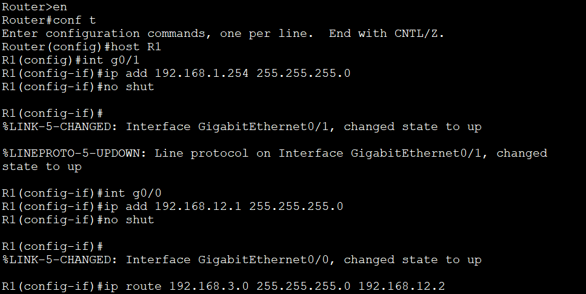

---

### 🔧 Task 2 — Configure R2

#### Configure Hostname

```plaintext
enable
configure terminal
hostname R2
```

#### Configure G0/0 (Link to R1)

```plaintext
interface g0/0
ip address 192.168.12.2 255.255.255.0
no shutdown
exit
```

#### Configure G0/1 (Link to R3)

```plaintext
interface g0/1
ip address 192.168.13.2 255.255.255.0
no shutdown
exit
```

#### Configure Static Routes

```plaintext
ip route 192.168.1.0 255.255.255.0 192.168.12.1
ip route 192.168.3.0 255.255.255.0 192.168.13.3
```

#### Verify

```plaintext
show ip interface brief
show ip route
write
```

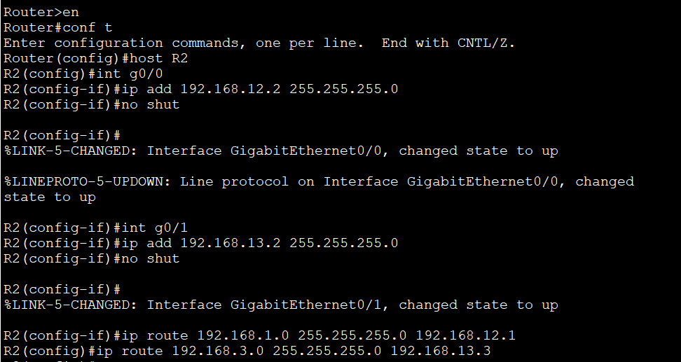

---

### 🔧 Task 3 — Configure R3

#### Configure Hostname

```plaintext
enable
configure terminal
hostname R3
```

#### Configure G0/0 (Link to R2)

```plaintext
interface g0/0
ip address 192.168.13.3 255.255.255.0
no shutdown
exit
```

#### Configure G0/1 (LAN)

```plaintext
interface g0/1
ip address 192.168.3.254 255.255.255.0
no shutdown
exit
```

#### Configure Static Route

```plaintext
ip route 192.168.1.0 255.255.255.0 192.168.13.2
```

#### Verify

```plaintext
show ip interface brief
show ip route
write
```

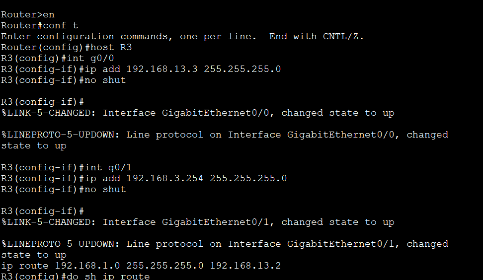

---

### 💻 Task 4 — Configure PC IP Addresses

#### PC1

- IP Address: **192.168.1.1**
- Subnet Mask: **255.255.255.0**
- Default Gateway: **192.168.1.254**

---

#### PC2

- IP Address: **192.168.3.1**
- Subnet Mask: **255.255.255.0**
- Default Gateway: **192.168.3.254**

---

## 🧪 Task 5 — Test Connectivity

### From PC1

```plaintext
ping 192.168.1.254
ping 192.168.12.2
ping 192.168.13.3
ping 192.168.3.254
ping 192.168.3.1
```

---

### From PC2

```plaintext
ping 192.168.3.254
ping 192.168.13.2
ping 192.168.12.1
ping 192.168.1.254
ping 192.168.1.1
```

---

## 📊 Expected Results

- R1 successfully reaches R2 and R3 using static routes ✅
- PC1 successfully pings PC2 ✅
- PC2 successfully pings PC1 ✅
- All router interfaces show **up/up** ✅
- Static routes appear in the routing table marked with **S** ✅


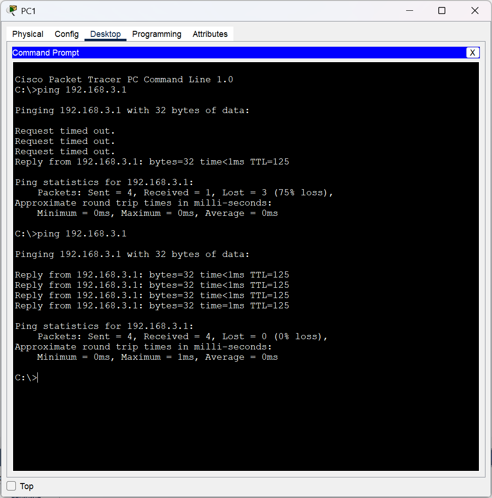

---

## 📸 Topology Screenshot

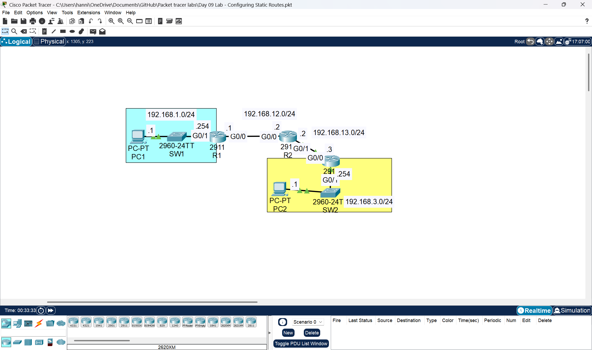

---
## 📅 Day 10 — Troubleshooting Static Routes

### 🎯 Lab Objective

Learn how to:

- Troubleshoot static routing issues
- Identify incorrect next-hop addresses
- Correct invalid static routes
- Fix incorrect interface IP addresses
- Verify routing tables
- Restore end-to-end connectivity between PCs

---

### 🧰 Devices Used

- 🛣️ Routers:

  - R1 (2911)
  - R2 (2911)
  - R3 (2911)

- 🔀 Switches:

  - SW1 (2960-24TT)
  - SW2 (2960-24TT)

- 💻 PCs:

  - PC1 → 192.168.1.1
  - PC2 → 192.168.3.1

---

### 🌐 Network Overview

| Network         | Router Interface | IP Address    |
| --------------- | ---------------- | ------------- |
| 192.168.1.0/24  | R1 G0/1          | 192.168.1.254 |
| 192.168.12.0/24 | R1 G0/0          | 192.168.12.1  |
| 192.168.12.0/24 | R2 G0/0          | 192.168.12.2  |
| 192.168.13.0/24 | R2 G0/1          | 192.168.13.2  |
| 192.168.13.0/24 | R3 G0/0          | 192.168.13.3  |
| 192.168.3.0/24  | R3 G0/1          | 192.168.3.254 |

---

### ⚠️ Initial Problem

At the beginning of the lab:

- ❌ PC1 cannot ping PC2.
- ❌ PC2 cannot ping PC1.
- ❌ Each router contains one incorrect configuration.

---

### 🔧 Task 1 — Troubleshoot R1

#### Verify Interfaces and Routing Table

```plaintext
enable
configure terminal
do show ip interface brief
do show ip route
```

#### ❌ Incorrect Static Route

```plaintext
S 192.168.3.0/24 via 192.168.12.3
```

#### Remove Incorrect Static Route

```plaintext
no ip route 192.168.3.0 255.255.255.0 192.168.12.3
```

#### ✅ Configure Correct Static Route

```plaintext
ip route 192.168.3.0 255.255.255.0 192.168.12.2
```

#### Verify

```plaintext
show ip route
write
```
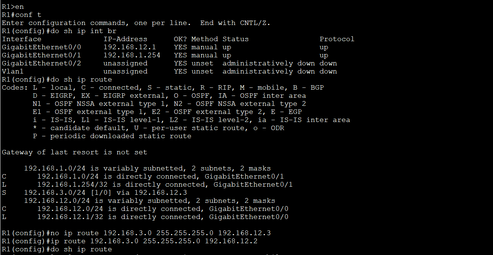

---

### 🔧 Task 2 — Troubleshoot R2

#### Verify Interfaces and Routing Table

```plaintext
enable
configure terminal
do show ip interface brief
do show ip route
```

#### ❌ Incorrect Static Route

```plaintext
S 192.168.3.0/24 is directly connected, GigabitEthernet0/0
```

#### Remove Incorrect Static Route

```plaintext
no ip route 192.168.3.0 255.255.255.0 g0/0
```

#### ✅ Configure Correct Static Route

```plaintext
ip route 192.168.3.0 255.255.255.0 192.168.13.3
```

#### Verify

```plaintext
show ip route
write
```
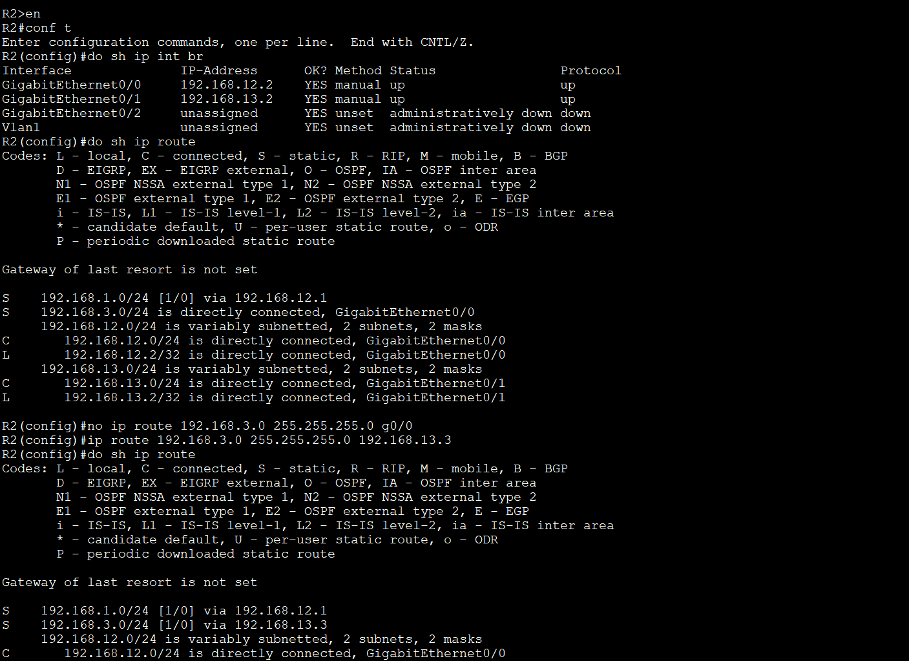

---

### 🔧 Task 3 — Troubleshoot R3

#### Verify Interface Configuration

```plaintext
enable
configure terminal
do show ip interface brief
```

#### ❌ Incorrect Interface IP

```plaintext
GigabitEthernet0/0
192.168.23.3
```

#### Enter the Interface

```plaintext
interface g0/0
```

#### Remove Incorrect IP Address

```plaintext
no ip address 192.168.23.3 255.255.255.0
```

#### ✅ Configure Correct IP Address

```plaintext
ip address 192.168.13.3 255.255.255.0
no shutdown
exit
```

#### Verify

```plaintext
show ip interface brief
write
```
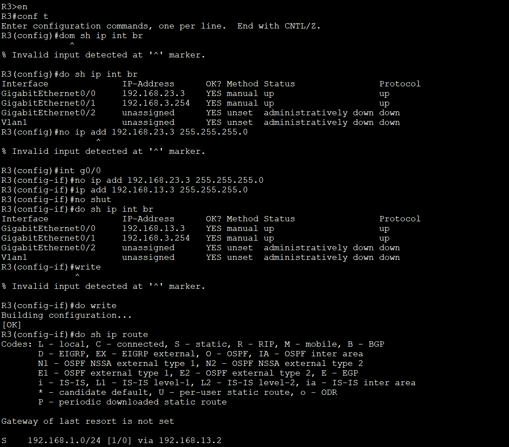

---

## 🧪 Task 4 — Test Connectivity

### From PC1

```plaintext
ping 192.168.3.1
```

---

### From PC2

```plaintext
ping 192.168.1.1
```
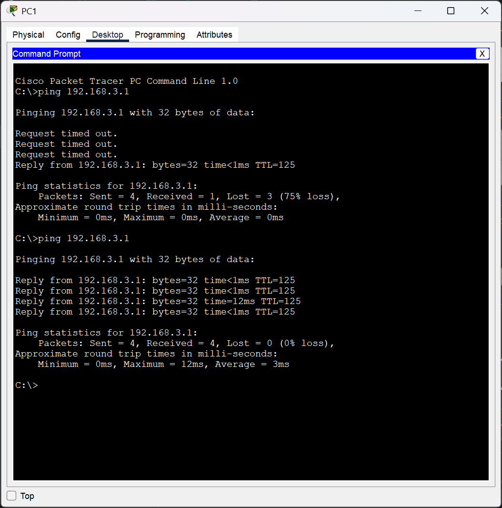

---

## 📊 Expected Results

- R1 contains the correct next-hop static route ✅
- R2 contains the correct static route to R3 ✅
- R3 has the correct interface IP address ✅
- PC1 successfully pings PC2 ✅
- PC2 successfully pings PC1 ✅
- Static routes appear in the routing table marked with **S** ✅
- All router interfaces show **up/up** ✅

---

## 📸 Topology Screenshot

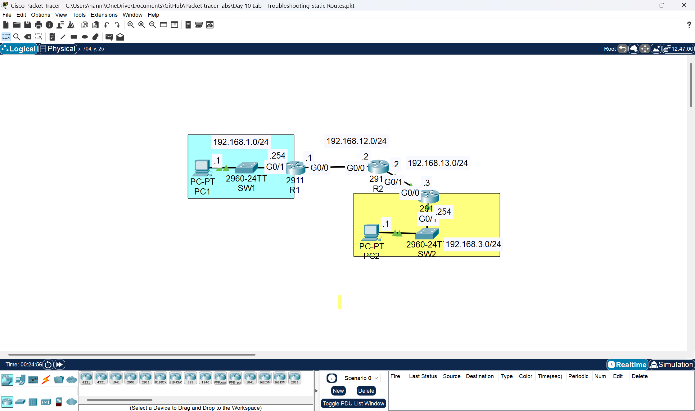

---
## 📅 Day 11 — Life of a Packet

### 🎯 Lab Objective

Learn how to:

- Identify source and destination MAC addresses
- Observe how Ethernet frames change at each router hop
- Understand Layer 2 forwarding through switches
- Observe Layer 3 routing between networks
- Use Packet Tracer Simulation Mode to analyze packet flow
- Verify MAC addresses using router and PC CLI commands

---

### 🧰 Devices Used

- 🛣️ Routers:

  - R1 (2911)
  - R2 (2911)
  - R3 (2911)

- 🔀 Switches:

  - SW1 (2960-24TT)
  - SW2 (2960-24TT)

- 💻 PCs:

  - PC1 → 192.168.1.1
  - PC2 → 192.168.1.2
  - PC3 → 192.168.1.3
  - PC4 → 192.168.3.1
  - PC5 → 192.168.3.2
  - PC6 → 192.168.3.3

---

### 🌐 Network Overview

| Network | Connected Devices |
| -------- | ----------------- |
| 192.168.1.0/24 | PC1, PC2, PC3, SW1, R1 |
| 192.168.12.0/24 | R1 ↔ R2 |
| 192.168.13.0/24 | R2 ↔ R3 |
| 192.168.3.0/24 | R3, SW2, PC4, PC5, PC6 |

---

## 🔧 Task 1 — PC1 Pings PC4

> **Before entering Simulation Mode, send one successful ping to complete ARP and MAC address learning.**

### Verify MAC Addresses

Use the following commands on each device.

#### PCs

```plaintext
arp -a
```

#### Routers

```plaintext
show interfaces
show arp
```

#### Simulation Mode

Follow the ICMP packet and identify the Ethernet source and destination MAC addresses at each hop.

### Identify the Source and Destination MAC Addresses

| Segment | Source MAC | Destination MAC |
| -------- | ---------- | --------------- |
| A. PC1 → SW1 | PC1 NIC | R1 G0/1 |
| B. SW1 → R1 | PC1 NIC | R1 G0/1 |
| C. R1 → R2 | R1 G0/0 | R2 G0/0 |
| D. R2 → R3 | R2 G0/1 | R3 G0/0 |
| E. R3 → SW2 | R3 G0/1 | PC4 NIC |
| F. SW2 → PC4 | R3 G0/1 | PC4 NIC |

---

## 🔧 Task 2 — PC1 Pings PC3

> **Send one ping before entering Simulation Mode to populate the ARP tables.**

### Verify MAC Addresses

```plaintext
arp -a
show arp
show interfaces
```

### Identify the Source and Destination MAC Addresses

| Segment | Source MAC | Destination MAC |
| -------- | ---------- | --------------- |
| A. PC1 → SW1 | PC1 NIC | PC3 NIC |
| B. SW1 → PC3 | PC1 NIC | PC3 NIC |

> Since PC1 and PC3 are on the same LAN, the frame is switched directly and never reaches the router.

---

## 🔧 Task 3 — PC4 Pings PC1

> **Again, send one successful ping before using Simulation Mode.**

### Verify MAC Addresses

```plaintext
arp -a
show arp
show interfaces
```

### Identify the Source and Destination MAC Addresses

| Segment | Source MAC | Destination MAC |
| -------- | ---------- | --------------- |
| A. PC4 → SW2 | PC4 NIC | R3 G0/1 |
| B. SW2 → R3 | PC4 NIC | R3 G0/1 |
| C. R3 → R2 | R3 G0/0 | R2 G0/1 |
| D. R2 → R1 | R2 G0/0 | R1 G0/0 |
| E. R1 → SW1 | R1 G0/1 | PC1 NIC |
| F. SW1 → PC1 | R1 G0/1 | PC1 NIC |

---

## 🧪 Verification Commands

### PCs

```plaintext
arp -a
ipconfig
```

### Routers

```plaintext
show interfaces
show arp
show ip interface brief
```

---

## 📊 Expected Results

- Each router removes the incoming Ethernet frame and builds a new one for the next hop. ✅
- The IP source and destination addresses remain unchanged throughout the route. ✅
- The Ethernet source and destination MAC addresses change at every router. ✅
- Switches forward frames without modifying the MAC addresses. ✅
- Frames between devices on the same LAN keep the same source and destination MAC addresses. ✅

---


## 📸 Topology Screenshot
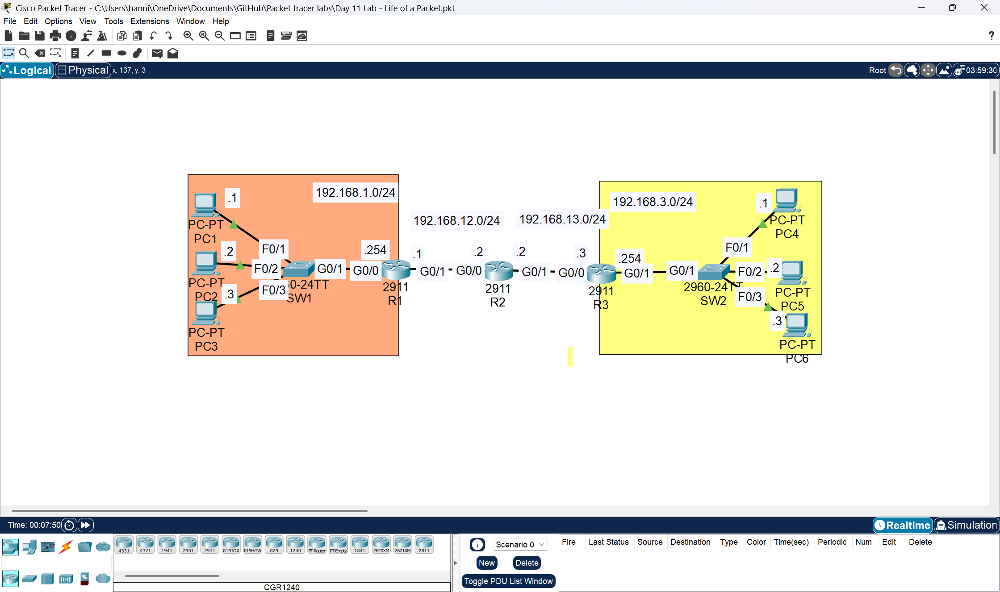

---
## 📅 Day 12 — Variable Length Subnet Masking (VLSM)

### 🎯 Lab Objective

Learn how to:

- Subnet a /24 network using VLSM
- Allocate subnets based on host requirements
- Configure router interfaces with VLSM addresses
- Configure PC IP addresses and default gateways
- Configure static routes between routers
- Verify end-to-end connectivity using ping

---

### 🧰 Devices Used

- 🛣️ Routers:

  - R1 (2911)
  - R2 (2911)

- 🔀 Switches:

  - SW1 (2960-24TT)
  - SW2 (2960-24TT)
  - SW3 (2960-24TT)
  - SW4 (2960-24TT)

- 💻 PCs:

  - PC1
  - PC2
  - PC3
  - PC4

---

### 🌐 VLSM Addressing Plan

Base Network: **192.168.5.0/24**

| Network | Hosts Required | Network Address | Mask | First Host (PC) | Last Host (Router) |
| -------- | -------------- | --------------- | ---- | --------------- | ------------------ |
| LAN2 | 64 | 192.168.5.0/25 | 255.255.255.128 | 192.168.5.1 | 192.168.5.126 |
| LAN1 | 45 | 192.168.5.128/26 | 255.255.255.192 | 192.168.5.129 | 192.168.5.190 |
| LAN3 | 14 | 192.168.5.192/28 | 255.255.255.240 | 192.168.5.193 | 192.168.5.206 |
| LAN4 | 9 | 192.168.5.208/28 | 255.255.255.240 | 192.168.5.209 | 192.168.5.222 |
| R1 ↔ R2 | 2 | 192.168.5.224/30 | 255.255.255.252 | R1 - 192.168.5.225 | R2 - 192.168.5.226 |

---

### 🔧 Task 1 — Configure R1

#### Configure G0/1 (LAN2)

```plaintext
enable
configure terminal
interface g0/1
ip address 192.168.5.126 255.255.255.128
no shutdown
exit
```

#### Configure G0/0 (LAN1)

```plaintext
interface g0/0
ip address 192.168.5.190 255.255.255.192
no shutdown
exit
```

#### Configure G0/0/0 (Link to R2)

```plaintext
interface g0/0/0
ip address 192.168.5.225 255.255.255.252
no shutdown
exit
```
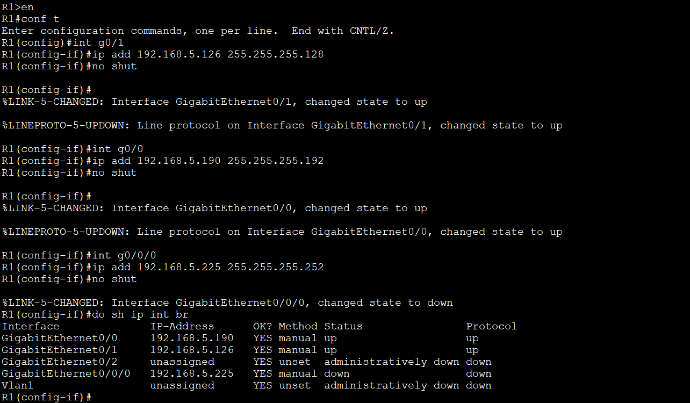

#### Configure Static Routes

```plaintext
ip route 192.168.5.192 255.255.255.240 192.168.5.226
ip route 192.168.5.208 255.255.255.240 192.168.5.226
```

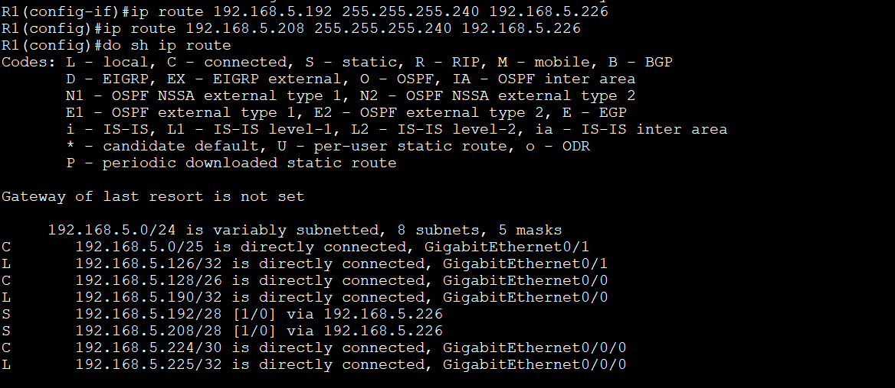


#### Verify

```plaintext
show ip interface brief
show ip route
write
```

---

### 🔧 Task 2 — Configure R2

#### Configure G0/0 (LAN3)

```plaintext
enable
configure terminal
interface g0/0
ip address 192.168.5.206 255.255.255.240
no shutdown
exit
```

#### Configure G0/1 (LAN4)

```plaintext
interface g0/1
ip address 192.168.5.222 255.255.255.240
no shutdown
exit
```

#### Configure G0/0/0 (Link to R1)

```plaintext
interface g0/0/0
ip address 192.168.5.226 255.255.255.252
no shutdown
exit
```
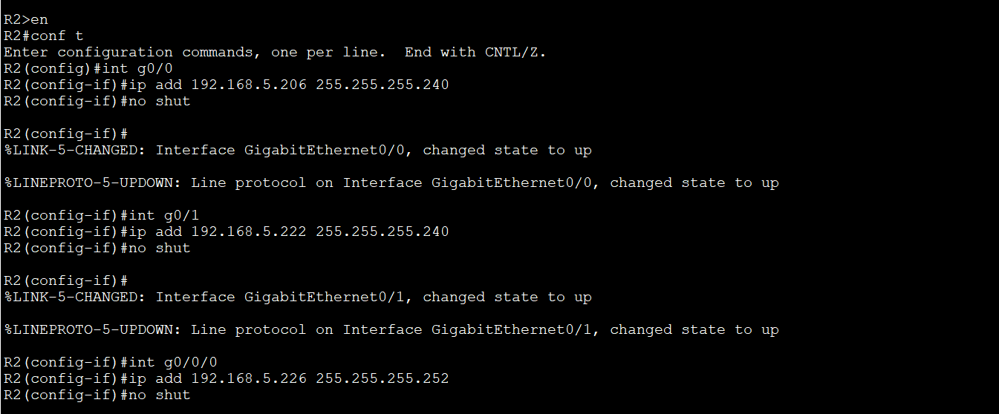


#### Configure Static Routes

```plaintext
ip route 192.168.5.128 255.255.255.192 192.168.5.225
ip route 192.168.5.0 255.255.255.128 192.168.5.225
```

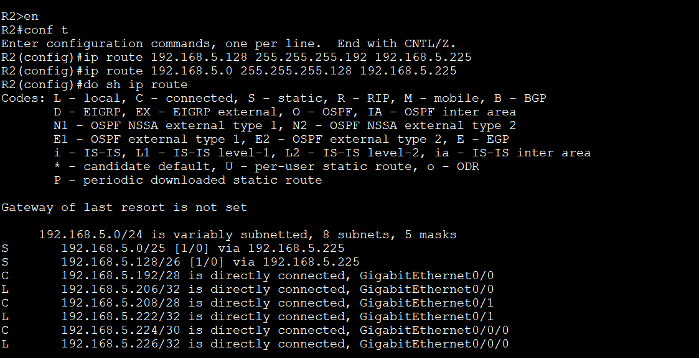


#### Verify

```plaintext
show ip interface brief
show ip route
write
```

---

### 💻 Task 3 — Configure PC IP Addresses

#### PC1 (LAN1)

- IP Address: **192.168.5.129**
- Subnet Mask: **255.255.255.192**
- Default Gateway: **192.168.5.190**

---

#### PC2 (LAN2)

- IP Address: **192.168.5.1**
- Subnet Mask: **255.255.255.128**
- Default Gateway: **192.168.5.126**

---

#### PC3 (LAN3)

- IP Address: **192.168.5.193**
- Subnet Mask: **255.255.255.240**
- Default Gateway: **192.168.5.206**

---

#### PC4 (LAN4)

- IP Address: **192.168.5.209**
- Subnet Mask: **255.255.255.240**
- Default Gateway: **192.168.5.222**

---

## 🧪 Task 4 — Test Connectivity

### From PC1

```plaintext
ping 192.168.5.209
ping 192.168.5.193
ping 192.168.5.1
```

---

### From PC2

```plaintext
ping 192.168.5.129
ping 192.168.5.193
ping 192.168.5.209
```

---

### From PC3

```plaintext
ping 192.168.5.1
ping 192.168.5.129
ping 192.168.5.209
```

---

### From PC4

```plaintext
ping 192.168.5.1
ping 192.168.5.129
ping 192.168.5.193
```

---

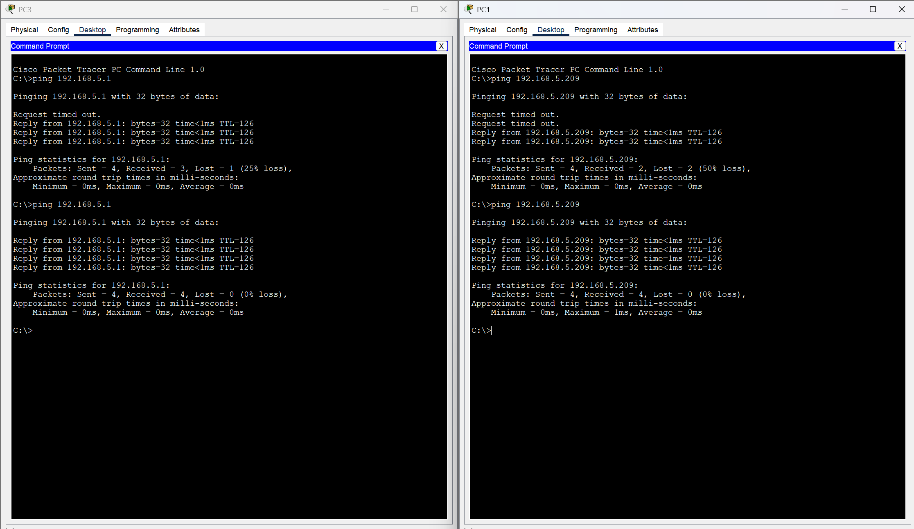


---
## 📊 Expected Results

- All VLSM subnets are correctly allocated. ✅
- PCs use the first usable address in each subnet. ✅
- Router interfaces use the last usable address in each subnet. ✅
- Static routes allow communication between all LANs. ✅
- Initial ping may time out due to ARP resolution. ✅
- Subsequent pings succeed with **0% packet loss**. ✅

---

## 📚 Skills Practiced

- Variable Length Subnet Masking (VLSM)
- Network planning
- IP address allocation
- Static routing
- Router interface configuration
- Route verification
- End-to-end connectivity testing

---

## 📸 Topology Screenshot

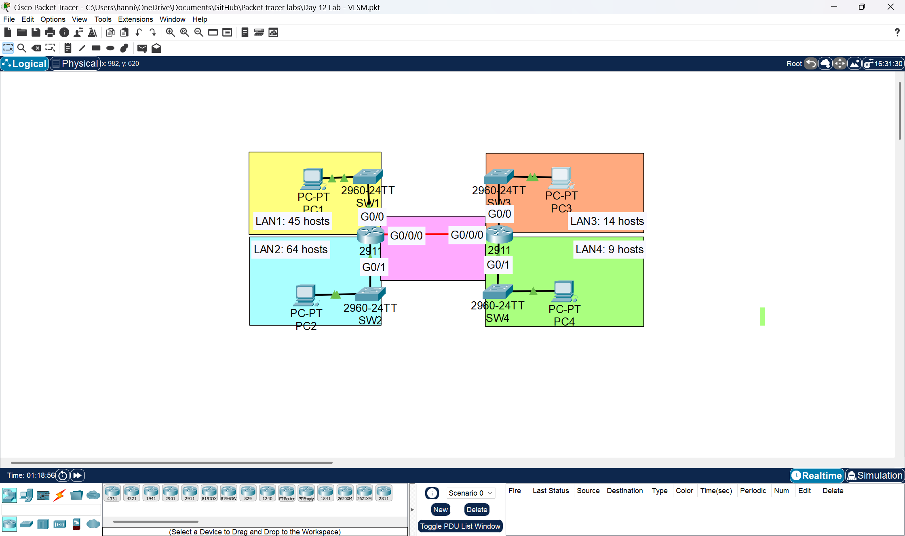


---
